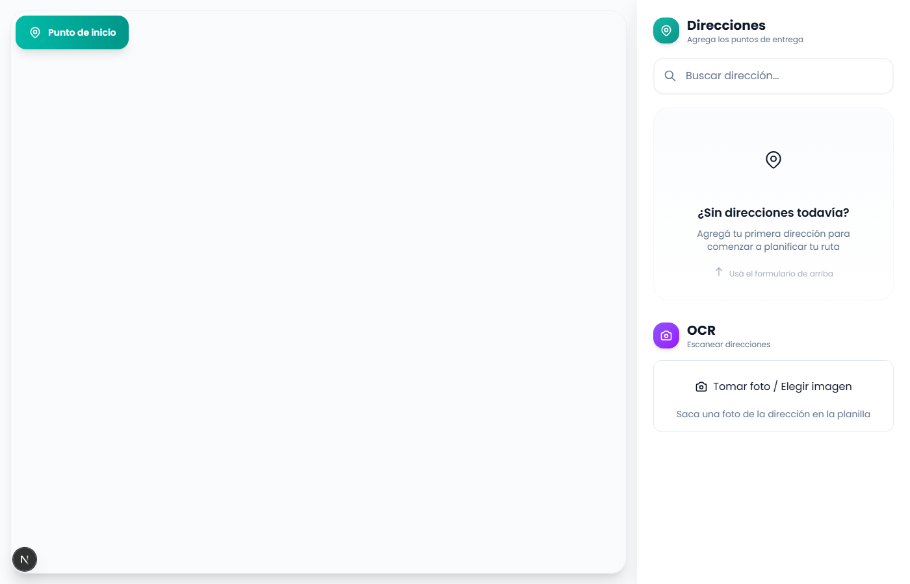
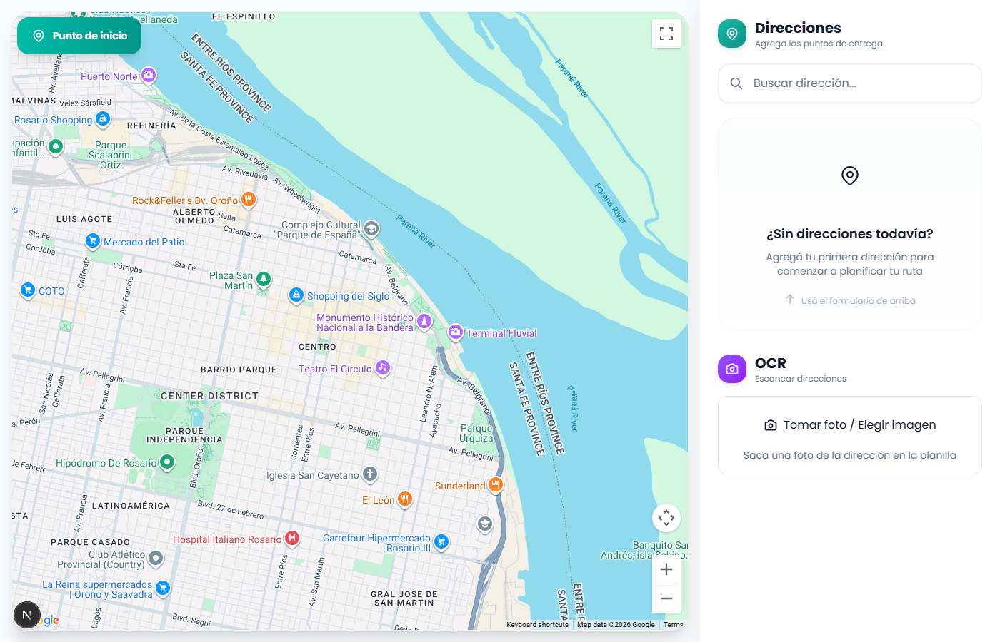

# Route Flow 🚚

> Optimizador de rutas para repartidores en Argentina

PWA para optimizar rutas de entrega. Carga hasta 1000 direcciones (manual o OCR), calcula rutas optimizadas priorizando tiempo, y guía al repartidor durante el recorrido con GPS en tiempo real.



## Tech Stack

- **Next.js 16** (App Router, Turbopack)
- **React 19** + TypeScript
- **Tailwind CSS 4**
- **Google Maps Platform** (@vis.gl/react-google-maps)
  - Directions API - Route optimization
  - Distance Matrix API - Time/distance calculations
  - Geocoding API - Address resolution
- **Tesseract.js** - OCR en navegador
- **IndexedDB** - Almacenamiento offline
- **OpenRouteService** - Fallback de rutas
- **Vitest** - Testing

## Getting Started

```bash
# Install dependencies
npm install

# Run development server
npm run dev

# Run tests
npm run test

# Build for production
npm run build
```

## Features

| Feature | Estado | Notas |
|---------|--------|-------|
| 📷 Carga de direcciones por foto (OCR) | ✅ INDEPENDENT | Usa Tesseract.js |
| 🗺️ Mapa con ruta optimizada | ✅ ACTIVE | Google Maps Directions API |
| 📍 Tracking GPS en tiempo real | ✅ INDEPENDENT | Browser Geolocation API |
| 🔄 Recálculo dinámico de rutas | ✅ ACTIVE | Google Maps + detección de desviación |
| 📱 PWA instalable | ✅ INDEPENDENT | Service Worker + Manifest |
| 🔌 Funciona offline | ✅ INDEPENDENT | IndexedDB para datos |
| 📊 Matriz de distancias | ✅ ACTIVE | Google Distance Matrix API |
| 🎯 Optimización de ruta (TSP) | ✅ ACTIVE | Google Directions + algoritmo 2-opt |
| 🔀 Modo de ruta (circular/lineal) | ✅ INDEPENDENT | Elegir retorno al inicio o no |

### Estados de Features
- **INDEPENDENT**: Funciona sin API key externa
- **ACTIVE**: Usa Google Maps API como primario
- **FALLBACK**: Usa ORS o cálculo local cuando Google no está disponible

## Screenshots

### Vista Principal


### Carga de Direcciones


## Configuración

Crear archivo `.env.local`:

```env
# REQUERIDO - Google Maps API Key
GOOGLE_MAPS_API_KEY=your-google-maps-api-key

# OPCIONAL - OpenRouteService (fallback)
NEXT_PUBLIC_ORS_API_KEY=your-ors-api-key
```

### Obtener Google Maps API Key

1. Ir a [Google Cloud Console](https://console.cloud.google.com/google/maps-apis/)
2. Crear proyecto o seleccionar existente
3. Habilitar las APIs:
   - Directions API
   - Distance Matrix API
   - Geocoding API
   - Maps JavaScript API
4. Crear credenciales (API Key)
5. Agregar al `.env.local`

**Importante**: Restringir la API key a tu dominio en Google Cloud Console por seguridad.

### Fallback Chain

Si Google Maps no está disponible, la app usa:
1. OpenRouteService (ORS) - si hay API key configurada
2. Cálculos locales (Haversine) - siempre disponible

## Docs

- [PRD](./docs/PRD.md) - Product Requirements
- [RFC](./docs/RFC.md) - Technical Specification
- [FEATURES](./docs/FEATURES.md) - Feature Matrix
- [ARCHITECTURE](./docs/ARCHITECTURE.md) - System Architecture

---

**Version**: 1.0.0 - MVP Release
